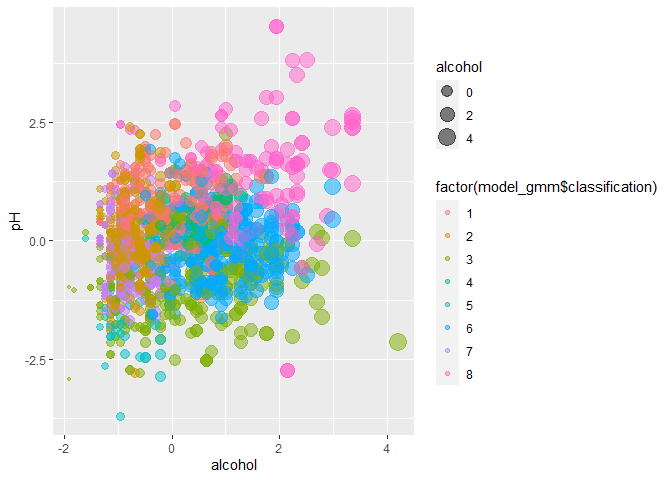
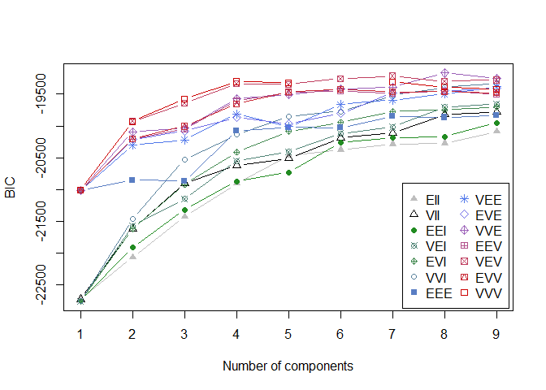

Ayudantia 8: Clustering Probabilistico
================

# Ayudantia 8

Para esta ayudantia utilizaremos un dataset que contiene la calidad de
diversos vinos que se evaluaron

## Importar Librerias

``` r
library(tidyverse)
library(cluster)
library(factoextra)
library(mclust)
```

Para un primer intento tomaremos todas las variables del dataset, ver
que cluster obtenemos y como se comportan los indicadores de cada modelo

## Cargar Datos

``` r
setwd("D:/Users/Italo/Documents/Italo Felipe/UAI/Semestre 11/Ayudantia Mineria de Datos/material ayudantia/Ayudantia8")

wine <- read.csv("winequality-red.csv",sep = ",")
wine <- wine[colnames(wine) %in% c("citric.acid","density", "pH", "sulphates", "alcohol","quality")]
```

## Comprobar Datos NA y Cambiar Tipo Data

``` r
wine %>% 
  summarise_all(funs(sum(is.na(.))))
```

    ## Warning: `funs()` was deprecated in dplyr 0.8.0.
    ## Please use a list of either functions or lambdas: 
    ## 
    ##   # Simple named list: 
    ##   list(mean = mean, median = median)
    ## 
    ##   # Auto named with `tibble::lst()`: 
    ##   tibble::lst(mean, median)
    ## 
    ##   # Using lambdas
    ##   list(~ mean(., trim = .2), ~ median(., na.rm = TRUE))

    ##   citric.acid density pH sulphates alcohol quality
    ## 1           0       0  0         0       0       0

``` r
str(wine)
```

    ## 'data.frame':    1599 obs. of  6 variables:
    ##  $ citric.acid: num  0 0 0.04 0.56 0 0 0.06 0 0.02 0.36 ...
    ##  $ density    : num  0.998 0.997 0.997 0.998 0.998 ...
    ##  $ pH         : num  3.51 3.2 3.26 3.16 3.51 3.51 3.3 3.39 3.36 3.35 ...
    ##  $ sulphates  : num  0.56 0.68 0.65 0.58 0.56 0.56 0.46 0.47 0.57 0.8 ...
    ##  $ alcohol    : num  9.4 9.8 9.8 9.8 9.4 9.4 9.4 10 9.5 10.5 ...
    ##  $ quality    : int  5 5 5 6 5 5 5 7 7 5 ...

``` r
class <- wine$quality
X <- wine[,1:5]
head(X)
```

    ##   citric.acid density   pH sulphates alcohol
    ## 1        0.00  0.9978 3.51      0.56     9.4
    ## 2        0.00  0.9968 3.20      0.68     9.8
    ## 3        0.04  0.9970 3.26      0.65     9.8
    ## 4        0.56  0.9980 3.16      0.58     9.8
    ## 5        0.00  0.9978 3.51      0.56     9.4
    ## 6        0.00  0.9978 3.51      0.56     9.4

## Escalar Data

``` r
data_sca <- sapply(X, scale) %>% as_tibble()

clPairs(data_sca,class)
```

<!-- -->

# DBSCAN

Primer metodo, clustering basado en densidad

``` r
library(dbscan)

model = dbscan(data_sca, eps = 0.5, minPts = 7)

model
```

    ## DBSCAN clustering for 1599 objects.
    ## Parameters: eps = 0.5, minPts = 7
    ## The clustering contains 7 cluster(s) and 1103 noise points.
    ## 
    ##    0    1    2    3    4    5    6    7 
    ## 1103  435   10   21    7    9   10    4 
    ## 
    ## Available fields: cluster, eps, minPts

El modelo genera 7 clusters, basado en los parametros que le entregamos
a la funcion dbscan.

Veamos que pasa al ir modificando esos valores

# Plot

``` r
ggplot(data_sca, aes(alcohol, pH, color = factor(model$cluster), size = alcohol)) + 
  geom_point(alpha = 0.3) 
```

<!-- -->

Se puede ver que hay diversos puntos que no quedan asignados a ningun
cluster dados los valores escogidos para la distancia minima.

Otros algoritmos como el c-means permiten asignarle un cluster a todos
los puntos

# Fuzzy C Means

``` r
library(e1071)

modelo_c_means <- cmeans(data_sca, 6, m=1.5) 

modelo_c_means$membership %>% head()
```

    ##                1          2           3           4           5          6
    ## [1,] 0.021610065 0.01076973 0.009517012 0.004071450 0.862875129 0.09115661
    ## [2,] 0.025837430 0.03612736 0.033481120 0.018086775 0.392215904 0.49425141
    ## [3,] 0.011468411 0.01529322 0.013624484 0.005647304 0.504024572 0.44994201
    ## [4,] 0.001668514 0.92764212 0.012890524 0.006573721 0.006630268 0.04459485
    ## [5,] 0.021610065 0.01076973 0.009517012 0.004071450 0.862875129 0.09115661
    ## [6,] 0.021610065 0.01076973 0.009517012 0.004071450 0.862875129 0.09115661

El algoritmo cmeans asigna como cluster al que tenga mayor probabilidad

``` r
#Plot
ggplot(data_sca, aes(alcohol, pH, color = factor(modelo_c_means$cluster), size = alcohol)) + 
  geom_point(alpha = 0.3) 
```

<!-- -->

Para los modelos de clustering difuso podemos calcular el Coeficiente de
partición difusa (FPC)

``` r
# FCP

matriz <- modelo_c_means$membership%*%t(modelo_c_means$membership) # producto matricial

(FPC <- sum(matriz*diag(nrow(matriz)))/nrow(matriz))
```

    ## [1] 0.5856823

El valor del FPC es bajo, lo que significa que los grupos tienen alta
variabilidad, y se puede confirmar en la figura ya que no se ven grupos
definidos.

# GMM

GMM permiten obtener clusters difusos pero utilizando modelos
probabilisticos

``` r
library(mclust)

model_gmm = Mclust(data_sca)

model_gmm 
```

    ## 'Mclust' model object: (VVE,8) 
    ## 
    ## Available components: 
    ##  [1] "call"           "data"           "modelName"      "n"             
    ##  [5] "d"              "G"              "BIC"            "loglik"        
    ##  [9] "df"             "bic"            "icl"            "hypvol"        
    ## [13] "parameters"     "z"              "classification" "uncertainty"

``` r
summary(model_gmm, parameters = TRUE)
```

    ## ---------------------------------------------------- 
    ## Gaussian finite mixture model fitted by EM algorithm 
    ## ---------------------------------------------------- 
    ## 
    ## Mclust VVE (ellipsoidal, equal orientation) model with 8 components: 
    ## 
    ##  log-likelihood    n df      BIC       ICL
    ##       -9226.311 1599 97 -19168.2 -19896.63
    ## 
    ## Clustering table:
    ##   1   2   3   4   5   6   7   8 
    ## 250 310 267  54  68 293 237 120 
    ## 
    ## Mixing probabilities:
    ##          1          2          3          4          5          6          7 
    ## 0.14266635 0.19332864 0.17500003 0.02881572 0.04491632 0.18667631 0.14065654 
    ##          8 
    ## 0.08794009 
    ## 
    ## Means:
    ##                   [,1]       [,2]       [,3]       [,4]       [,5]        [,6]
    ## citric.acid -1.1540627 -0.5071098  1.3171953 -1.3452007  0.5577020  0.54012336
    ## density     -0.1866776 -0.2021853  1.0182799 -0.7176674  0.2541287 -0.42539383
    ## pH           0.7136479  0.1310066 -0.8157525  0.4901083 -1.1137354 -0.06126223
    ## sulphates   -0.2755478 -0.5881715  0.3721133 -0.4177849  2.4792363  0.32034831
    ## alcohol     -0.1369883 -0.7032966  0.2579831  0.4236640 -0.8315366  0.72038716
    ##                   [,7]       [,8]
    ## citric.acid  0.1124952 -0.8046712
    ## density      0.6835104 -1.3639044
    ## pH          -0.2862645  1.1737433
    ## sulphates   -0.3989213 -0.1717989
    ## alcohol     -0.7602264  1.2276190
    ## 
    ## Variances:
    ## [,,1]
    ##             citric.acid       density            pH    sulphates     alcohol
    ## citric.acid  0.05359516 -0.0360540474 -0.0794792304  0.014898701  0.04305234
    ## density     -0.03605405  0.5101659895  0.0001016788  0.017102508 -0.25402773
    ## pH          -0.07947923  0.0001016788  0.4784815898 -0.001583028  0.05718799
    ## sulphates    0.01489870  0.0171025079 -0.0015830278  0.493303962  0.01894800
    ## alcohol      0.04305234 -0.2540277346  0.0571879939  0.018947996  0.55606973
    ## [,,2]
    ##             citric.acid     density          pH   sulphates     alcohol
    ## citric.acid  0.27574467 -0.02010774 -0.05851115 -0.03295216 -0.01765065
    ## density     -0.02010774  0.13956272  0.11394344  0.03972833 -0.03976645
    ## pH          -0.05851115  0.11394344  0.59801414  0.15729763  0.03619880
    ## sulphates   -0.03295216  0.03972833  0.15729763  0.15987420  0.01360001
    ## alcohol     -0.01765065 -0.03976645  0.03619880  0.01360001  0.12497690
    ## [,,3]
    ##              citric.acid       density          pH    sulphates     alcohol
    ## citric.acid  0.295462769 -0.0525878786 -0.07066497 0.0090107523  0.07145034
    ## density     -0.052587879  1.0317626378 -0.05615813 0.0009408695 -0.46325861
    ## pH          -0.070664971 -0.0561581291  0.70054251 0.0172055396  0.09189421
    ## sulphates    0.009010752  0.0009408695  0.01720554 0.6612901405  0.01113715
    ## alcohol      0.071450336 -0.4632586124  0.09189421 0.0111371495  1.12760580
    ## [,,4]
    ##              citric.acid     density           pH   sulphates      alcohol
    ## citric.acid  0.008965662 -0.01452132 -0.015661892 0.001219535  0.016232845
    ## density     -0.014521324  0.17373809 -0.011026257 0.002259220 -0.132481656
    ## pH          -0.015661892 -0.01102626  0.101837432 0.007301057  0.026606003
    ## sulphates    0.001219535  0.00225922  0.007301057 0.082084906  0.004474018
    ## alcohol      0.016232845 -0.13248166  0.026606003 0.004474018  0.200460786
    ## [,,5]
    ##             citric.acid    density          pH  sulphates     alcohol
    ## citric.acid  0.82174038 0.01956598 -0.04828211  0.3167314 -0.03913698
    ## density      0.01956598 0.16864302  0.03479088  0.1373079  0.03390679
    ## pH          -0.04828211 0.03479088  0.85551995 -1.1113144 -0.06400852
    ## sulphates    0.31673144 0.13730787 -1.11131440  3.9335331  0.21372865
    ## alcohol     -0.03913698 0.03390679 -0.06400852  0.2137287  0.16104422
    ## [,,6]
    ##             citric.acid      density            pH    sulphates     alcohol
    ## citric.acid  0.19450857 -0.048259295 -0.0491609277 0.0103945584  0.03923642
    ## density     -0.04825930  0.578683233 -0.0087755164 0.0231583327 -0.44177852
    ## pH          -0.04916093 -0.008775516  0.4824193671 0.0006550841  0.09038893
    ## sulphates    0.01039456  0.023158333  0.0006550841 0.4769233222  0.02893926
    ## alcohol      0.03923642 -0.441778519  0.0903889292 0.0289392568  0.66335708
    ## [,,7]
    ##              citric.acid      density           pH    sulphates      alcohol
    ## citric.acid  0.415443458 -0.003598493 -0.008825159 -0.025668552 -0.025255355
    ## density     -0.003598493  0.175115988  0.072030708  0.021523082  0.024904587
    ## pH          -0.008825159  0.072030708  0.471876770  0.099273611  0.010440818
    ## sulphates   -0.025668552  0.021523082  0.099273611  0.190031402  0.004918008
    ## alcohol     -0.025255355  0.024904587  0.010440818  0.004918008  0.157323948
    ## [,,8]
    ##             citric.acid     density         pH   sulphates     alcohol
    ## citric.acid  0.28615979 -0.11403060 -0.1876428 -0.03859197  0.06218325
    ## density     -0.11403060  0.98304265  0.1258394  0.08121137 -0.80416742
    ## pH          -0.18764278  0.12583940  1.3493317  0.27011744  0.20652695
    ## sulphates   -0.03859197  0.08121137  0.2701174  0.60058272  0.05268205
    ## alcohol      0.06218325 -0.80416742  0.2065270  0.05268205  1.10810112

El modelo genero clusters los que se pueden visualizar igual que los
ejemplos anteriores

``` r
# Plot
ggplot(data_sca) + 
  aes(x=alcohol, y=pH, color=factor(model_gmm$classification), size=alcohol) + 
  geom_point(alpha=0.5)
```

<!-- -->

``` r
fviz_cluster(model_gmm, data_sca, stand = FALSE, frame = FALSE,geom = "point")
```

    ## Warning: argument frame is deprecated; please use ellipse instead.

<!-- -->

El modelo aplicó todas las formas posibles de la matriz de covarianzas,
y permite visualizar como evoluciona el BIC a medida que aumentamos el
numero de clusters. Esta visualizacion permite ver que la mayoria de los
modelos deja de mejorar sobre clusters

# BIC

``` r
plot(model_gmm, what = "BIC")
```

<!-- -->
